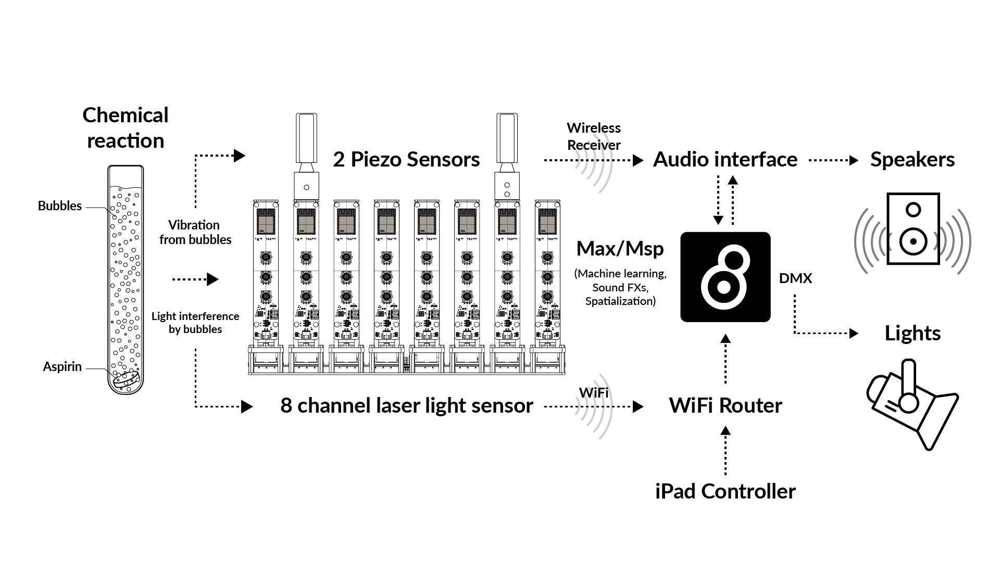

# Liquid Prism (ESP32 Board)

**_ESP32 board with three light sensors for laser. This code allows the custom-designed esp32 board to get values from scattered laser light in the test tube. The data from the board is transmitted through WiFi to the sound system._**

- Chihim Chik - Sound, Interaction design
- Sangbong Lee - Hardware design, Microcontroller programming

## Introduction

Liquid Prism is a laboratory-like instrument that measures the subtle nuances of the liquid in several test tubes and its movements and changes due to chemical interactions with aspirin and other substances. The reactions, including bubbles, that occur during the melting process are converted into audio-visual data by an integrated laser beam and piezo sensors and can thus be experienced.

The work is inspired by the attitudes and practices of alchemists in the pre-scientific era. When we first encounter matter in its true form, without the proper analytical tools, what we feel is chaos or even noise. Just as alchemists of the past interpreted the chaotic and mysterious changes of matter in the realm of subjective experience rather than science, this work reinterprets the chemical reactions that occur when matter dissolves into a soundscape through the phenomena of light and vibration.

: Exhibition, Water paths, Performance, 24.05.2024, MS Dauerwelle - HFK Boat, Bremen, Germany 
- Photo: Jimmy Liu, Hsu HsunHsiang

Video link: https://vimeo.com/980528463
- Video recorded by Gabriela Valdespino, Alethia Pinzon Rodriguez
- Video edited by Chihim Chik

## Interaction diagram
The instrument consists of eight signal generators made up of test tubes and electronic circuits. Each device generates two kinds of signals from chemical reactions inside the tubes and transmits them to the sound system, which generates soundscapes based on two kinds of data. The lasers in the device are scattered by the bubbles inside the tube, and this interaction is converted into a digital signal that is transmitted. Piezo sensors coupled to the mouth of the tube transmits the vibrations created by the bubbles inside to the system.

## Gallery

